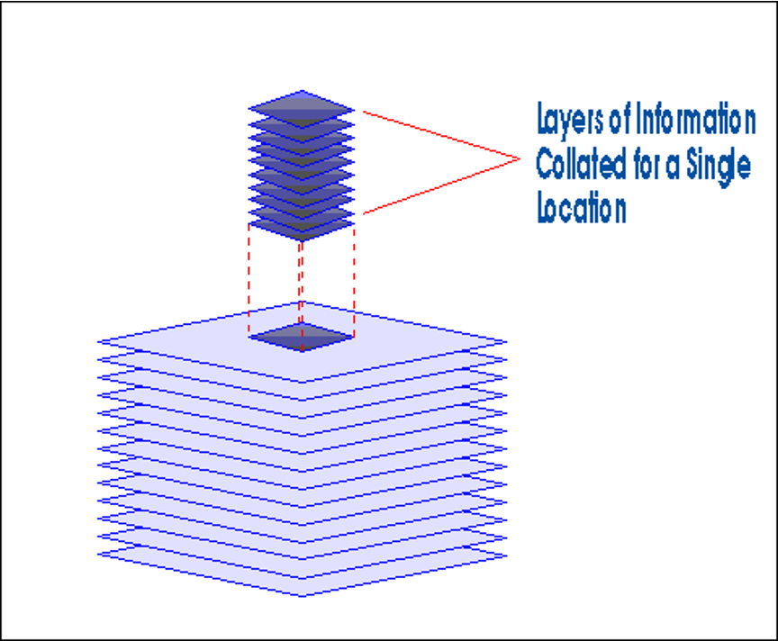

# GIS

## DEFINITION

Capturing, Storing, Retriving, Analysing, Manipulating, Interpreting and The Display of Spatial data.

---

## FOUR STEPS OF GIS

- DATA INPUTS
- DATA STORAGE
- DATA TARNSFORMATION
- DATA REPORTING

---

## ADVANTAGES OF GIS

- Integration of data
- Updating
- Spatial modeling
- Accuracy
- Speed
- Flexibility

---

## ESSENTIAL ELEMENTS OF GIS

1. HARDWARE COMPONENTS
2. SOFTWARE MODULES

Tags: Components of GIS

### HARDWARE COMPONENTS

- Processing unit
- Spatial data system
- Graphic display system
- Plotter / printer

### SOFTWARE MODULES

- Data input
- Database Management
- Analysis
- Data Display and Output

#### Sources of Data Inputs for GIS

Tags: Different Sources of Data Input for GIS

1. Existing Maps, Field Observations, Sensors
2. Interactive terminals, Digitizers, Text Files, Scanners, Magnetic media
3. Data Input

#### GIS Data Types

1. Spatial Data
2. Non-Spatial Data

#### GIS DATA MODEL

- RASTER DATA MODEL-array of pixels
- VECTOR DATA MODEL-points, lines, polygons
- Network-system of connected features through which resources flow
- Links, Barriers, Turns, Centers, Stops etc.
- Links and Nodes

---

## APPLICATIONS OF GIS

- Urban planning.
- Service infrastructure.
- Disaster- monitoring management,mitigation
- Land use and land cover analysis.
- Water resource management.
- Surveying and mapping
- GIS has great future and its applications are endless.
- Many disciplines can take benefit from GIS technique.
- GIS is preferred now a days due to improved software's and hardware's available at lower cost.
- Hence its use in government organization business and industries increased considerably.
- GIS has great future and its applications are endless.

## APPLICATIONS OF GIS IN CIVIL ENGINEERING

- Urban planning.
- Service infrastructure
     1. Transportation applications
     2. Utilities applications
     3. Other service infrastructure application.
- Flood monitoring and management.
- Land use and land cover analysis.
- Water resource management

---

### GIS SOFTWARES IN MARKET

- ILWIS
- ERDAS
- ArcInfo
- ArcView
- MapInfo
- TNT
- Idrisi Kilimanjaro
- Idrisi Andes
- Cartalinx
- Geomedia
- Geometica

---

## FLOW CHARTS

Tags: (For search in Page purpose)

FLOW CHARTS 1

1. Remote Sensing Output Layers, GIS output Layers (combined overlay)
2. Different Layers combination
3. Layout of all layers
4. Decision Making
5. Support by ground truthing field checks

FLOW CHARTS 2

1. Contoured Topographic Map
2. Digitized Watershed Boundary Map, Vilage Map, Digitized Contour Map, Reserved Map, Digitized Drainage Map, Road Map
3. Interpolation
4. Digitized Elevation Model / Digital Elevation Model
5. Dititization
6. classification
    1. Slope Percentage Map
        - IMSD Classification
        - Generation of stereopair and anaglyphs of all rasters
        - Classification Slope Shaped Map
        - Studied for Developmental activities along with other point and Raster layers
    2. Slope Degree Map
        - Young's Classification
        - Classified Slope Degree Map
    3. Slope Direction Map
    4. Slope Shape Map
        - Classified Slope Shape Map
    5. Slope Aspect Map
        - Classified Slope Aspect Map
    6. Flow Accumulation Map
        - Classified Flow Accumulation Map
7. Digitized Drainage Map
    1. Statistical Tables
        - Interpolation
    2. Study in combination with other RS and GIS rasters
        - Segment map of water harvesting structures
        - Point Later of developmental activities
    3. Extraction of major mini watersheds
        - Morphometric analysis of miniwater sheds
        - Interpolation

FLOW CHARTS 3

1. RIS DATA IRS 10 LISS III
2. Geometric Correction and Rectification
3. Data import and extraction
4. Subscence of watershed
5. Geocoding and Georeferencing (Linear Stretching)
    1. Standard FCC
        - Cluster Map
    2. Stretched Image
        - Generation of stereo Model of all layers(Analysis and Interpolation)
            1. Study of Geology And Geomorphology of the area
            2. Location and Feasibility of Water Harvesting Structures
            3. Location and Feasibility of other development activities
            4. Confirmation of the interpretation of Geomorphometric Analysis
    3. Image Transformation Band Ratio
        - NDVI

---

## GIS vs MANUAL WORK

Tags: Manual vs GIS work, Manual Word vs GIS work

| MAPS    |     GIS     | MANUAL |
|---------|-------------|--------|
| Storage | Standardized and integrated| Different scales on different standards|
| Updating          | search by computer   | Manual Checks  |
| Spatial Analysis  | very fast            | Time and energy consuming  |
| Display           | easy cheap and fast  | Complicated and Expensive  |

---

## ILWIS METHODOLOGY

DATA IMPORT
IMAGE PROCESSING
COLOUR COMPOSITE
SUBMPAP
GEOREFERENCING
ASSIGNING SCALE FACTOR
GEOCODING,COORDINATE SYSTEM
DIGITIZATION-POINT.SEGMENT,POLYGON
LENGTH AND AREA MEASUREMENT
CREATION OF LAYOUTS
DATA EXPORT

## ILWIS Project

ILWIS Full Form Integrated Land & Water Information System

- Efficient transport system
- Synoptic view
- sprawl development of Karad city
- temporal data source
- high resolution recent data
- RS and GIS layer outputs.

### KARAD Details

Karad is an ancient town situated on the confluence of the two sacred rivers, Krishna and Koyana. The confluence is better known as Preeti sangam, which is unique in nature.

Karad town lies between 17°17’ North latitude and 74°16’east longitude. According to census of 2001, the population of Karad city is 56149.

The town is 670.73meters above mean sea level

### RS and GIS data tools

1. high resolution Cartosat-1 data
2. IRS-1D, LISS-III

Satellites and sensors of data

1) IRS-1D LISS-3          P-95            R-60
Date of acquisition – 28 Feb. 2003
23.5 m resolution

2) IRS-P5 Sensor – Pan F (PAF)    P-0523       R-360
Date of acquisition – 23 March 2007
2.5 m resolution

IRS-P5 (Cartosat-1), launched on May 5, 2005, catapulted the Indian Remote Sensing program into the world of large scale mapping and terrain modeling applications.

The LISS-III, PAN and WiFS sensors on IRS-1C (December 1995) and IRS-1D (September 1997) ,application areas like resources survey and management, urban planning, forest studies, disaster monitoring and environmental studies.

### FLYOVER PROPOSAL KARAD

The flyover  starts at Cottage hospital Chowk and ends with Karmaveer Patil Chowk.

The two-lane both way flyover passing through the Vijay Chowk and Stand area.

Description in Brief:
Location – On the Krishna naka to Kolhapur naka road from Cottage hospital Chowk to Karmaveer Patil Chowk

The total length of flyover is 587m.
The Clear height at the Vijay Chowk is 5.5m.
The clear height at front of Stand is 4.5m and at front of Town hall is 5m.

The total width of road at Vijay Chowk to Krishna naka is 30m and to Datta Chowk are 20m. The proposed flyover is of 10m. It is of both ways. It situated at the center of the existing road. Hence there is single lane road on either side, which  carries one-way traffic. The flyover has each lane of 3.96m. The lanes are separated with the 80mm divider. The flyover has 0.5m wide parapet and 0.5m wide footpaths on both sides.
The main abutment is at the Vijay Chowk. The piers are on either side of the Vijay Chowk. The piers are at 20m distances apart. Total number of piers is seventeen. The girder used is of prestressed type. The RCC slab of 250mm is provided. The height of substructure is varying with the gradient. The height of superstructure is 1.3m. The height of parapet above slab is 1.05m.  

### ILWIS CONCLUSION REMARKS

- only tool for synoptic view is remote sensing data
- high-resolution data (Cartsosat-1)
- standard FCC of IRS -1D LISS III
- ILWIS was found to be very effective in getting fast, accurate and reliable data output for urban planning
- Using RS and GIS with software’s, traffic model can be formulated
- Synthetic Aperture Radar (SAR) data can be used for mapping the flood inundation area and the transportation network along side the riverbank can be modified accordingly.

---

## [REMOTE SENSING](/RS.md)

## [GIS](/GIS.md)
