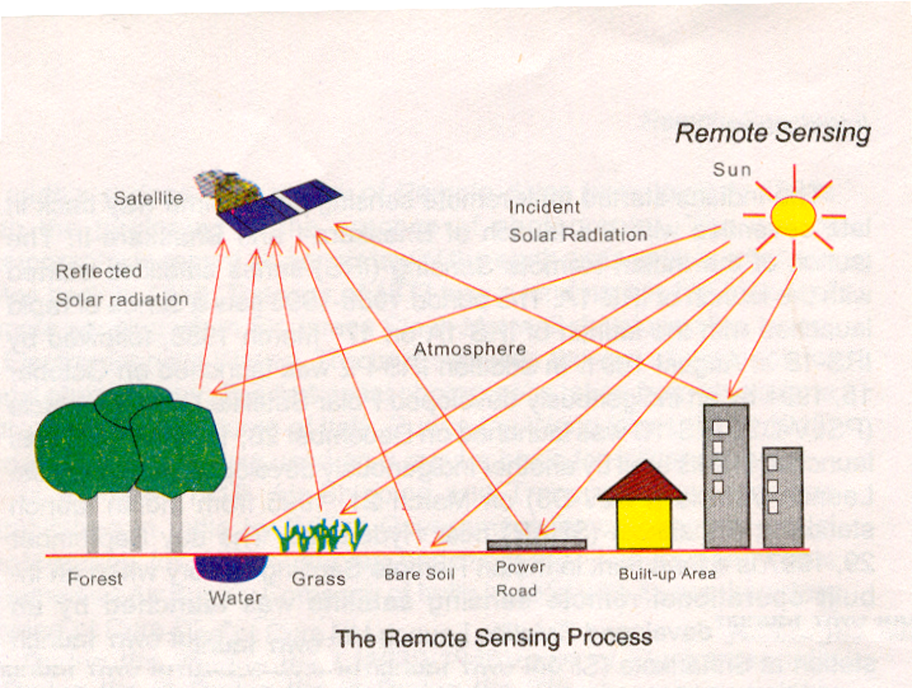

# REMOTE SENSING

## DEFINITION

The technique of acquiringinformation about an object by **recording device(sensor)**
i.e. Not in physical contact with theobject by measuring portion of reflected or emittedelectromagnetic radiation from the earth’s surface.

---

## PRINCIPLE OF REMOTE SENSING

- Different objects return (reflects or emits) different amount & kind of energy in different bands of electromagnetic spectrum incident upon it.

- This unique property depends on the-
  - structural,
  - chemical,
  - physical **properties of material**
  also
  - surface roughness,
  - angel of incidence,
  - intensity &
  - wavelength of **radiant energy.**

- Remote Sensing is multidisciplinary science which includes
  - optics,
  - spectroscopic,
  - photography,
  - computer science,
  - electronics & telecommunication,
  - satellite tech. etc.

- All these technologies are integrated to act as remote sensing.

---

## PROCESS OF REMOTE SENSING

---

## STAGES IN REMOTE SENSING

### 1. Energy source

Emission of electromagnetic radiation or EMR (sun/ self emission).

### 2. Energy Interactions With Atmosphere

Transmission of energy from the source to the surface of the earth as well as ABSORPTION & SCATTERING.

### 3. Interaction of EMR With the Earth Surface

Reflection & emission transmitted or absorbed by the surface.

### 4. Recording of Energy by the Remote Sensor

Sensor not in touch with the earth’s surface

### 5. Sensor Data Output

Data transmission & reception.

### 6. Data (Image) Processing & Analysis

Extraction of information @ the earth surface features.

### 7. Application

Extracted information is utilized in decision making for solving problems.

---

## TYPES OF RS

### A) Types of RS Based on Source of Energy

#### 1. PASSIVE SENSORS

Remote Sensing systems measuring the **naturally available energy** ( Solar energy: either reflected or absorbed) are called as Passive Sensors.

#### 2. ACTIVE SENSORS

Remote Sensing systems which provides their **own source of energy for illumination** are known as 'Active Sensors'.
e.g.

1. SLAR: Side looking airborne radar
2. SAR: Synthetic Apareture Radar

### B) Based on range of electromagnetic spectrum

#### 1. OPTICAL RS

RS of Visible, NIR,MIR 0.3 um - 3 um.

#### 2. THERMAL RS

RS of emitted radiation 3 um - 5 um. & 8 um - 16 um.

#### 3. MICROWAVE RS

RS in higher wavelength 1mm—1m

---

## ADVANTAGES OF RS

### Synoptic View

- Facilitates the study of various earth surface features in    their spatial relation to each other.
- Helps to delineate the reqd. features & phenomenon.

### Accessibility

Possible to gather information at the area when ground survey is not possible.
e.g. Mountainous areas & foreign areas.  

### Time conservation

Information at the large area is gathered quickly saving time efforts of human.

### Multidisciplinary Applications

Remote Sensing data is processed & used in different disciplines like  (Applications og GIS)

- GEOLOGY
- FORESTRY
- LANDUSE
- AGRICULTURE
- DEFENCE
- URBAN PLANNING
- FISHERIES
- CIVIL ENGINEERING

---

### ELECTROMAGNETIC RADIATION

#### 1. WAVE MODEL

#### 2. PARTICLE THEORY

Radiation consists of electrical and magnetic fields perpendicular to each other, moving in wave pattern.

- Wavelength (lambda)
- Frequency (v)
- Amplitude (A)

---

## ELECTROMAGNETIC SPECTRUM

Representing the continuum of EMR arranged on the basis of wavelength and frequency.

Electromagnetic spectrum ranges as…

1. Gamma Ray  ---------------  shorter wavelengths
2. X-ray
3. Ultraviolet
4. Visible spectrum  ----------  400nm—700nm
5. Infrared
6. Microwaves
7. Radiowaves  ---------------  Longer wavelength

## ENERGY INTERACTION WITH THE ATMOSPHERE

Atmosphere affect incoming radiation by

- **Scattering:**
  - Rayleigh scattering
  - Mie scattering
  - Non selective scattering
- **Absorption:**
  - O3    Ozone
  - CO2  Carbon Dioxide
  - H2O  Water Vapour
- **Refraction:** Atmospheric layer of varyingclarity, humidity, temperature.

---

## ATMOSPHERIC WINDOWS

- These are the regions in the electromagnetic spectrum for which the atmosphere is transparent.
- These wavelengths are easily transmitted through atmosphere.
- These are useful regions for remote sensing.

---

## REFLECTION CHARACTERISTICS OF EARTH COVER

It may be qualified by measuring the portion of incident energy that is reflected.
Vegetation

- Red & Blue colors are absorbed.
- Green & NIR are reflected.

Water :

- All radiation are absorbed.
- Blue or Blue-Green colors are little reflected.

Soil :

- Depend on Moisture,
- Organic Content,
- Texture,
- Structure,
- Iron Oxide Content etc.

### Spectral Reflectance Curves

- Refectance Curves for Fresh Snow
- Refectance Curves for Old Snow and ice
- Refectance Curves for Vegetation
- Refectance Curves for Needleleaf vegetation
- Refectance Curves for Dry Soil
- Refectance Curves for Wet Soil
- Refectance Curves for Turbid Water
- Refectance Curves for Clear Water

---

## SATELLITES & SENSORS

### PLATFORMS

Platform is a stage to mount the camera or sensors to collect informationremotely about an object or surface.

#### TYPES OF PLATFORM

- Ground
- Balloon
- Aircraft
- Space Craft / Satellite

### SATELLITE ORBIT

- Path followed by the satellite.

#### 1. GEOSTATIONARY SATELLITE

  1. Revolve at the speed matching the rotation of the Earth(**24 hours**).
  2. Located at very high altitudes about **36000Km**
  3. Are put in the equatorial plane orbiting **West to East.**
  4. One satellite can view **one-third of the globe.**
  5. Used for **weather monitoring & communication** (INSAT, V-Sat).
  6. Geo-Synchronous (Equatorial Orbiting) Satellites : Telecommunications, Weather

#### 2. SUN-SNYCHRONOUS SATELLITE

  1. Inclined **'North-South'** orbit.
  2. Inclination carries the satellite Westward.
  3. Its track covers each area of the world at a Constant time of the day ( local sun time ).
  4. **Descending pass** of sun-synchronous satellites – day
  5. **Ascending pass** of sun-synchronous satellites – shadow ( night )
  6. Payload of **passive sensors**.
  7. Active sensors can acquire image in ascending pass also.

| Day Pass(Sun-Synchronous)| Night Pass(Sun-Synchronous) |
|:---:|:---:|
|  |  |
| Day Pass : Descending | Night Pass : Ascending |

---

## SWATH (Two Dimensional Image of Earth Surface For An Area)

**Q. What is SWATH?**

- As a satellite revolve around the Earth, the sensors see a certain portion of Earth surface known as swath.
- For satellite images it is very wide between 10 -100 Km.
- The apparent Westward shift of satellite ( due to Earth’s rotation ) allows the satellite Swath to cover a new area with each pass.

| SWATH STAGES | SWATH STAGES |
|---------|--------|
|    |     |
| 1. Ground Segment (Recieving Antenna)   |   2. Satellite Path (Data Acquisition)
|    |     |
|  3. Successive Paths (Gap between Paths) | 4 Stereoscopic Data Acquisition  |

---

## List of Satellites

 

## RESOLUTION

It refers to the system’s ability to **Record & Display Fine Details.**
In Remote Sensing there are **Four Types of Resolution**

- Spatial resolution
- Spectral resolution
- Radiometric resolution
- Temporal resolution.

### TYPES OF RESOLUTION

- **Spatial resolution:** The **size of the smallest possible feature** that can be detected by the sensors.
- **Spectral resolution:** It describes the **ability of a sensors to define fine wavelength intervals.** Many RS systems record energy over several separate wavelengths ranges at various spectral resolution. These are multispectral scanners. Advanced multispectral sensors detect hundreds of very narrow spectral bands through the spectrum.
- **Radiometric resolution:** Every time an image is acquired on film or by a sensor, its **sensitivity to the magnitude of the electromagnetic energy** determines the radiometric resolution.
- The radiometric resolution of an imaging system describes its **ability to discriminate very slight differences in the energy**.

- **Temporal resolution:** Temporal resolution refers to the **frequency of obtaining data over a given area**. It is **related to the revisit period or repeativity.**

**Spatial Resolution Diagrams:**

| DIAGRAM | SENSOR(Meter) |
|---------|--------|
|     | 30m : LS-TM, 80m : LS-MSS |
|     | 10m : SPOT-PLA, 20m : SPOT-MLA |

## MULTISPECTRAL SCANNING

A scanning system that is useful to collect data over a range of wavelengths is called MSS.

| Across track scanning | Along track scanning |
|---|---|
| scan lines **Perpendicular** to motion of system | scan lines **Parallel** to motion of system |

---

## SATELLITE IN ORBITS

### LANDSAT SATELLITE

NASA (National Aeronautic & Space Administration) launched the LANDSAT series. It is Land Observation Satellite Series.

- RBV :-  Return Beam Vidicon.
- MSS :- Multispectral scanner. Across track, 4 spectral band data with 80 meters resolution & 6 bits radiometric resolution.
- TM :-   Thematic map per, 7 ban data for 6 bands, spatial resolution of 30 metres & for thermal band, 120 metres,
- ETM :- Enhanced Thematic map per, 8 band data.
- Swath :- 185 Km.

### SPOT SATELLITE

- Altitude :- 832 Km.
- Revisit  :- 26 days.
  **Payload**
- HRV – High resolution visible sensor.
  - PAN mode 10 m
  - MSS mode 20 m
- HRVIR – Spot 4 – 10 m resolution
- VEGETATION – Spot 4 – 1.165 Km resolution

### INDIAN REMOTE SENSING SATELLITE

| OBS. NO. | MISSIONS | SENSORS | ALTITUDE (Km) | REVISIT (DAYS) |
|----|---|---|---|---|
| 1. | IRS-1A | LISS-I, LISS-II | 904 | 22 |
| 2. | IRS-1B | LISS-I, LISS-II | 904 | 22 |
| 3. |**IRS-1C** | PAN          | 817 | 05 |
|    |        | LISS-III        | 817 | 24 |
|    |        | WIFS            | 817 | 05 |
| 4. | **IRS-1D** | PAN         | 817 | 05 |
|    |        | LISS-III        | 817 | 24 |
|    |        | WIFS            | 817 | 05 |
| 5. | IRS-P2 | LISS-III        | 817 | 24 |
| 6. | IRS-P3 | WIFS            | 817 | 05 |
|    |        | MOS             | 817 | 05 |
|    |        | ASTRONOMY       | 817 | 05 |
| 7. | IRS-P4 | OCR             | 727 | 03 |
|    |        | MSMR            | 727 | 03 |

### INDIAN REMOTE SENSING SATELLITE SENSORS LIST

| OBS. NO. | SENSORS | SPECTRAL RESOLUTION | SPATIAL RESOLUTION | SWATH |
|----|----------|---------|--------|--------|
| 1. | LISS-I   | 4 BANDS | 72.50M | 148 KM |
| 2. | LISS-II  | 4 BANDS | 36.25M | 074 KM |
| 3. | LISS-III | 4 BANDS | 23.50M | 141 KM |
| 4. | PAN      | 1 BANDS | 05.80M | 070 KM |
| 5. | WIFS     | 2 BANDS | 188.0M | 810 KM |

### REMOTE SENSING SATELLITE AND SENSORS LIST

| SATELLITE| VERSION   | MULTI SPRECTRAL SENSORS            |
|----------|-----------|------------------------------      |
| LANDSAT  | 1,2,4,5,7 | **MSS**: 2VIS + 2NIR               |
| LANDSAT  | 3         | **MSS**: 2VIS + 2NIR + 1 TIR       |
| LANDSAT  | 4,5,7     | **BANDS**: 1,2,3,4,5,7 VIS & NIR   |
| LANDSAT  | 4,5,7     | **BANDS**: 6 - TIR                 |
| IRS      | 1A/1B     | LISS-I/II                          |
| IRS      | 1C/1D     | LISS-I/III  **4 BANDS**: 2VIS+2NIR |
| SPOT     | MLA       | 3 BANDS                            |
| SPOT     | PLA       | 1 BAND (PAN)                       |
| ERS      |           | MICROWAVE SAR                      |
| JERS     |           | MICROWAVE SAR                      |

---

## SATELLITE DATA RECEPTION,TRANSMISSION & PROCESSING

- There are **Three** main options for **'transmitting data acquired by satellite'** to the surface.

1. Data can be **directly transmitted** to the earth if a Ground Receiving Station **(GRS) is in the line of sight** of the structure.
2. Data can be **recorded on board the satellite for transmission to a GRS at later** time.
3. Data can also be **relayed** to the GRS through the **TDRSS( Tracking & Data Relay Satellite System )** which contains **series of Geosynchronous, communication** satellite.

## GRS IN INDIA

GRS is located at **Shadnagar**. **NRSA** ( National Remote Sensing Agency ) acquires process, & distribute the satellite data from Indian as well as other satellites.

### Data tranmission Stages

Satellite (IRS,LANDSAT, SPOT,NOAA, IKONOS )
to
GRS ( Shadnagar – data in raw digital format )
to
NRSA (processing to correct errors & Convert to standard format )

---

## DIGITAL IMAGE PROCESSING

### What is Digital Image Processing

Image Processing is manipulation of the images with the help of a Computer System.

| HARDWARE                            | SOFTWARE                  |
| --------                            | --------                  |
| MONITOR                             | 1. Image Processing       |
| CPU                                 | 2. Image Enhancement      |
| Secondary Storage Devices           | 3. Image Classification   |
| Floppy Disc, Hard Disc, Scanner etc.|                           |

## 1. IMAGE PROCESSING

Preliminary to the main analysis :-

- Removal of error introduced in the imaging.
- Processes are designed to recognize & compensate for:
   Errors,
   Noise,
   Geometric distortions
   which are introduced into the data during the scanning, transmission & recording processes.

### PREPROCESSING

- Radiometric corrections
- Atmospheric corrections
- Geometric corrections

#### Radiometric correction

Radiometric errors are caused by detector imbalance & atmospheric deficiencies.
Radiometric corrections are transmitted on the data in order to remove errors, which are atmospheric correction.
Rediometric corrections are geometrically independent.
Radiometric corrections are also called as **Cosmetic corrections**
Rediometric corrections are done to improve the appearance of the image.

##### Examples of Radiometric Correction

- Correction of missing scan line
- Correction for periodic line striping
- Random noise corrections

#### Atmospheric corrections

True ground-leaving radiance is altered by scattering & hence it needs corrections these corrections are called as Atmospheric corrections.

#### Geometric corrections

The transformation of remotely sensed images so as it has a scale & projections of a map is called as **Geometric correction.** Systematic & nonsystematic disorders are corrected in Geometric Correction.

---

### 2. IMAGE ENHANCEMENT

Image enhancement technique improves the quality & appearance of an image for human visual analysis & subsequently for machine also.
Common techniques are:

- Contrast stretch
- linear & nonlinear
- Spatial filtering
- Band rationing
- principal component analysis

#### Photo Interpretation Elements / Image Interpretation Elements

1. SIZE
2. SHAPE
3. SHADOW
4. TONE
5. COLOR
6. TEXTURE
7. PATTERN

##### TONE IMAGE

##### TEXTURE IMAGE

##### PATTERN IMAGE

##### SHADOW IMAGE

---

### 3. IMAGE CLASSIFICATION

We normally  categorize the objects on the Earth’s surface  as forest, agriculture field, river, settlements etc.
Digital Image Classification is the process of **assigning pixels to classes**. These classes represents regions on the image or map & are **identified by the number or symbol**.

#### CLASSIFICATION TYPES

1. SUPERVISED
2. UN-SUPERVISED

##### 1. SUPERVISED

**Supervised Image Classification** is the process of known identity (trained pixels ) to classify the pixels, whose identity is not known.

###### DIFFERENT PHASES IN SUPERVISED CLASSIFICATION

- **Appropriate classification scheme** for analysis is adopted.
- **Selection of representative** training site & collection of spectral signatures.
- **Evaluation of statistics** for the training site spectrum data.
- The statistics are **analyzed to select the appropriate features** ( bands ) to be used in the classification process.
- Appropriate classification **algorithm is selected**.
- Classify the **image into N classes**.
- Statistically analyze & **evaluate the classification scheme**.

##### 2. UN-SUPERVISED

classifiers do not utilized training data  as basis of classification; classes are spectral classes; need of reference data to identify  informational value of the spectral  class.

Sample area known as training areas. Statistics are calculated for training sites. And every pixels within & outside the training site is assigned to a class or category it most likely resembles.

## THERMAL IR SENSING

- Thermal Ranges:3 to 5 and 8 to15 Um.
- **Emittance:**
  - Radiation,
  - Day and Night Temperature Changes,
  - Emittances of terrain features.
- **Radiometers and Scanners (Cooled Detectors):**
  - Low-Energy,
  - Coarse-Resolutions : Spatial and Spectral.
- **Day and Night Time Thermal Images:**
  - Geology,
  - Geo-Thermal,
  - Volcanic, Fires,
  - Thermal pollution, etc.
- **Thermal Data:**
  - Landsat-3       : Band-8,
  - Landsat- 4 / 5  : Band 6.
  - Day and Night - time.
- **Interpretation:**
  - Cool : Dark (low emittances),
  - Hot : Bright (high emittances)  

---

## REMOTE SENSING APPLICATIONS

---

## [REMOTE SENSING](/RS.md)

## [GIS](/GIS.md)

&copy; [Swapnil Saste](https://theswapnil.me)
